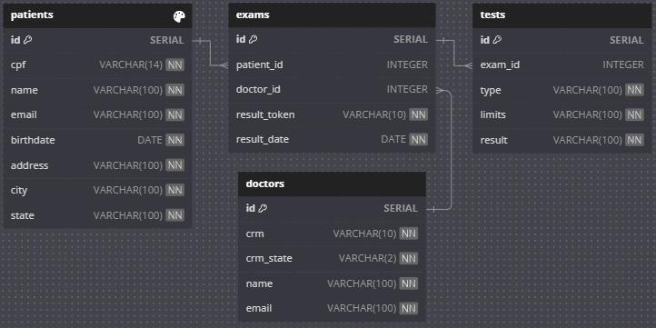

# LabsLabs
Uma app web para listagem e importação de exames médicos feita com Ruby, Sinatra, PostgreSQL, Redis, Sidekiq e HTML/CSS/JS.

- [Instalação](#instalação)
- [Testes](#testes)
- [Backend](#backend)
  - [API](#api)
  - [Sidekiq](#sidekiq)
  - [Redis](#redis)
- [Frontend](#frontend)
  - [Importar exames](#importar-exames)
  - [Listar exames](#listar-exames)
  - [Pesquisar exames](#pesquisar-exames)
  - [Visualizar exame](#visualizar-exame)
- [Banco de Dados](#banco-de-dados)
  - [Diagrama de Entidade-Relacionamento](#diagrama-de-entidade-relacionamento)
  - [Popular o banco de dados](#popular-o-banco-de-dados)
- [Melhorias futuras](#melhorias-futuras)

## Instalação

### Requisitos
- Git
- Docker

### Clone o repositório e entre na pasta
```bash
git clone git@github.com:hreis1/rebase_labs.git
cd rebase_labs
```

### Initialize os serviços
Execute o comando para subir as aplicações:
```bash
docker compose up -d
```
Com isso, será criado:
  - Um container com o banco de dados rodando na porta 5432.
  - Um container com a api rodando na porta 3000.
  - Um container com o frontend rodando na porta 3001.
  - Um container com o Sidekiq
  - Um container com o Redis

## Testes
Com o servidor criado, execute o comando para rodar os testes do backend:
```
docker compose exec api rspec
```
Os testes do backend são feitos com RSpec e testam as rotas da API, os modelos e as classes do diretório `./api/lib` usando o banco de dados de teste `postgres_test`.

Os testes do frontend são feitos manualmente.

## Backend

### API
A API é uma aplicação Sinatra que fornece os seguintes endpoints:
- `GET /api/tests`: Lista todos os exames no banco de dados.
- `GET /api/tests/:token`: Obtem um exame a partir do token.
- `POST /api/tests/import`: Importa exames a partir de um arquivo CSV.

A API retorna os exames no formato JSON. Os exemplos de requisição e resposta podem ser encontrados em [API.md](./api/API.md).

### Sidekiq
O Sidekiq é um serviço que processa os jobs de importação de exames. Ele é utilizado para processar a importação de exames em segundo plano, evitando que a aplicação fique travada enquanto o arquivo é importado.

### Redis
O Redis é um banco de dados em memória que é utilizado pelo Sidekiq para armazenar os jobs.

## Frontend

### Importar exames
Na página inicial, clique no botão "Importar CSV" e selecione o arquivo CSV que deseja importar. Após a importação, a página será recarregada e a tabela de exames será atualizada. Dependendo do tamanho do arquivo, a importação pode demorar alguns segundos. Recomenda-se o uso do arquivo `./api/spec/support/data.csv` para testar a importação.

### Listar exames
Na página inicial, a tabela de exames será atualizada com os exames importados. Cada linha da tabela representa um exame e cada coluna representa um atributo do exame.

### Pesquisar exames
Na barra de pesquisa, você pode pesquisar exames por token, data do exame, nome do paciente, cpf do paciente ou nome do médico. A tabela será filtrada de acordo com o que foi digitado.

### Visualizar exame
Clique em qualquer linha da tabela para visualizar os detalhes do exame. Um modal será aberto com os detalhes do exame.


## Banco de Dados
O banco de dados utilizado é o PostgreSQL. Ele é criado automaticamente quando o servidor é iniciado pela primeira vez, inicializado com as configurações do arquivo `./api/config/init.sql`, criando o database `postgres` e o database `postgres_test` com as tabelas necessárias.

### Diagrama de Entidade-Relacionamento
As tabelas do banco de dados foram modeladas de acordo com o diagrama de entidade-relacionamento a seguir:



### Popular o banco de dados
Com o servidor criado, execute o script para importar os dados do CSV localizado em `./api/data/data.csv` para o banco de dados:
```bash
docker compose exec api ruby import_from_csv.rb
```
O script lê o arquivo e importa os exames para o banco de dados de forma síncrona sem utilizar o Sidekiq.

## Melhorias futuras
- Adicionar paginação na listagem de exames.
- Adicionar filtros na listagem de exames.
- Adicionar validação de CPF e email na importação de exames.
- Adicionar teste no frontend.
- Adicionar CI/CD.
- Adicionar suporte a outros formatos de arquivo na importação de exames.
